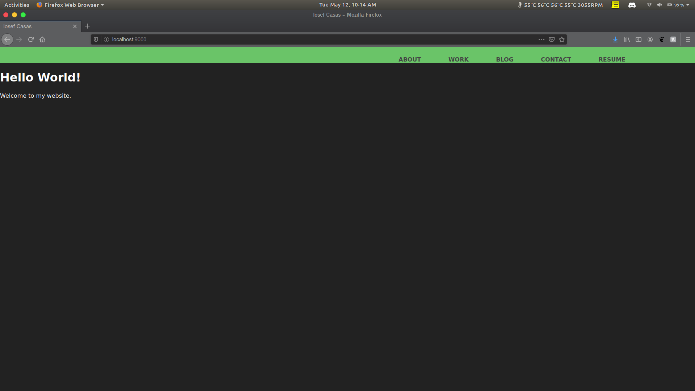
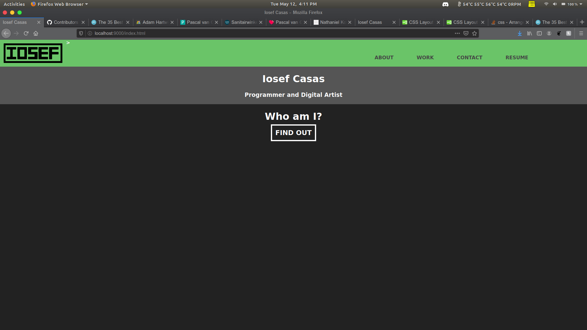
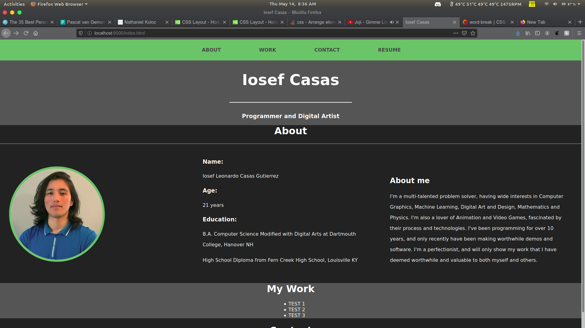

# ioseflcasas.com

## Author: Iosef Casas

Made for both creating a personal resume/portfolio sight and for DALI lab coding challenge.

I have once tried to make a website using WordPress as a base, however, I found myself completely unfamiliar with HTML, CSS and PHP. Though I made something somewhat functional, I ended up far more frustrated with myself and web design as field. This time I wanted to give it another try and after looking at 3 portfolio websites, I felt inspired.

This site is a one pager, with the intention for my project links to connect to either a more detailed blog-style page or towards a blog post. But for now will simply feature thumbnails, a short description and a link to either their repository or ShaderToy link.

Special thanks to the incredible people that made the websites I was inspired by and learned from.

### Alpha work progress

#### Hello World!
- Running a very basic Hello World prompt with a bit of styling.
- Header being separate from the body.
- Color scheme will not change from here. Dark theme all the way!

#### Beginning to add content
- Some sectioning was getting underway as I was learning wrappers and CSS classes.
- Attempting to work with buttons and links.
- Made a very simple logo but ended up chosing to not have a logo at challenge.
- As can be seen, was doing my best to learn from other websites.

#### Design going along.
- Drew a rough design on paper, inspired by Pascal, with his one pager.
- Gawdiness being my goal, I'll be adding it all into a basic resume/portfolio site.

### Beta Version 1.0

Reaching the end of my self-induced time limit, on May 16, 2020. This is mainly for the DALI Lab submission.
Things accomplished.
- Learned HTML, CSS and some web-design
- Created a customized theme and one-pager website
- Have my projects lined out in a attractive styles
- Dark Theme prevailed once more

TODOs
- Learn js to have more attractive animation. Such as the skill section. Should ideally have animations on scroll
- There is a bit of clunkiness to the theme, needs more refinement
- More optimized code, there is a lot that still needs work. The skill list being too verbose.

### Beta Version 1.1

Added
- Javascripts to make more interesting animations
- Resume download link

### Beta Version 1.2

Added
- Grid layout
- Proper text and image scaling

Thank you Justin Baltzar! Great help!

Still have alignment issues with the Header Navbar animations
- Removed top bar animation
- Added text grow animation
